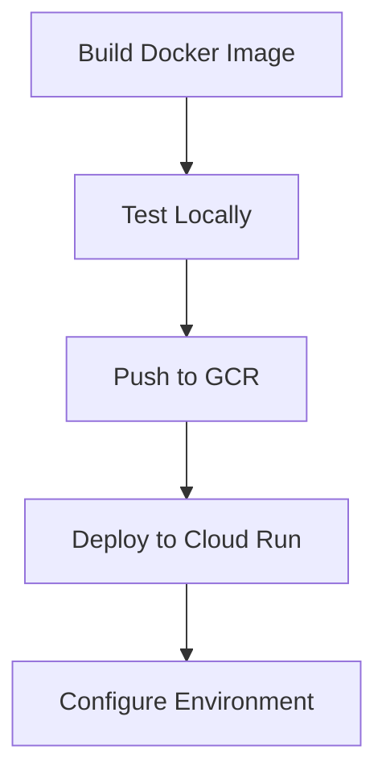

# 📈 Stock Market AI Agent

An intelligent agent for analyzing stock market data, providing insights, and assisting with investment decisions.

## ✨ Features

- 🔄 **Real-time Market Data**: Access up-to-date stock prices and market indicators
- 📊 **Technical Analysis**: Apply advanced algorithms for pattern recognition and trend analysis
- 🔍 **Sentiment Analysis**: Track market sentiment from news and social media
- 💼 **Portfolio Management**: Get recommendations based on your investment goals
- ⚠️ **Risk Assessment**: Evaluate potential risks and volatility in your investments

## 🧰 Prerequisites

| Requirement | Version | Purpose |
|-------------|---------|---------|
| [Python](https://www.python.org/downloads/) | 3.8+ | Core runtime environment |
| [Docker](https://docs.docker.com/get-docker/) | Latest | Containerized deployment |
| API Keys | Valid | Market data access |
| Google Cloud | Account | Cloud deployment |

## 🚀 Getting Started

### 💻 Local Development Setup

1. Clone the repository:
   ```bash
   git clone https://github.com/Yash-Kavaiya/stock-market-ai-agent.git
   cd stock-market-ai-agent
   ```

2. Create and activate a virtual environment:
   ```bash
   python -m venv venv
   source venv/bin/activate  # On Windows: venv\\Scripts\\activate
   ```

3. Install dependencies:
   ```bash
   pip install -r requirements.txt
   ```

4. Set up environment variables:
   ```bash
   # Create a .env file with your API keys
   ALPHA_VANTAGE_API_KEY=your_alpha_vantage_key
   NEWS_API_KEY=your_news_api_key
   SECRET_KEY=your_secret_key
   FLASK_ENV=development
   ```

5. Run the application:
   ```bash
   flask run
   ```

## ☁️ Deploying to Google Cloud Run

### Deployment Workflow



### Step 1: Add Gunicorn to requirements.txt

Ensure `gunicorn` is in your requirements.txt file for production deployment:

```bash
echo "gunicorn==21.2.0" >> requirements.txt
```

### Step 2: Build and Test Docker Container Locally

```bash
# Build the Docker image
docker build -t stock-market-ai-agent .

# Run the container locally
docker run -p 8080:8080 --env-file .env stock-market-ai-agent
```

Visit http://localhost:8080 to test your application.

### Step 3: Deploy to Google Cloud Run

```bash
# Authenticate with Google Cloud
gcloud auth login

# Configure Docker to use Google Container Registry
gcloud auth configure-docker

# Set your Google Cloud project ID
gcloud config set project YOUR_PROJECT_ID

# Build and push the Docker image
docker build -t gcr.io/YOUR_PROJECT_ID/stock-market-ai-agent .
docker push gcr.io/YOUR_PROJECT_ID/stock-market-ai-agent

# Deploy to Cloud Run
gcloud run deploy stock-market-ai-agent \
  --image gcr.io/YOUR_PROJECT_ID/stock-market-ai-agent \
  --platform managed \
  --region us-central1 \
  --allow-unauthenticated \
  --set-env-vars="ALPHA_VANTAGE_API_KEY=your_key,NEWS_API_KEY=your_key,SECRET_KEY=your_secret"
```

## 📚 API Documentation

The agent exposes several API endpoints:

| Endpoint | Method | Description |
|----------|--------|-------------|
| `/api/stock/{symbol}` | GET | Get current stock information |
| `/api/analysis/{symbol}` | GET | Get technical analysis for a stock |
| `/api/portfolio/optimize` | POST | Optimize portfolio allocation |

For detailed API documentation, see the [API Documentation](docs/api.md).

## 📁 Project Structure

```
stock-market-ai-agent/
├── api/                 # API routes and controllers
├── models/              # Machine learning models
├── services/            # External service integrations
├── utils/               # Utility functions and helpers
├── tests/               # Test suite
├── Dockerfile           # Container definition
├── requirements.txt     # Python dependencies
└── README.md            # This file
```

## 🤝 Contributing

Contributions are welcome! Please feel free to submit a Pull Request.

## 📝 License

This project is licensed under the MIT License - see the LICENSE file for details.
