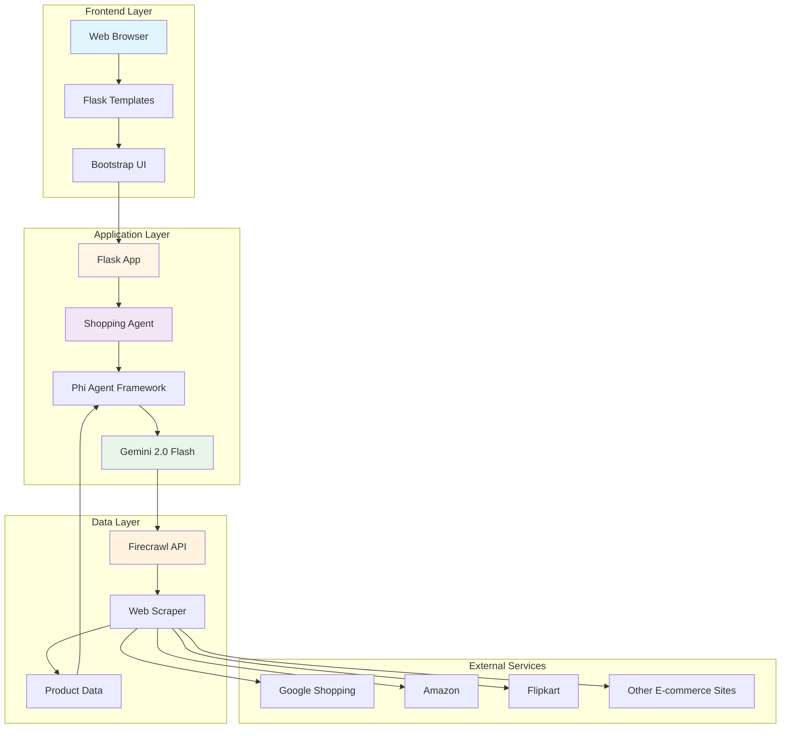
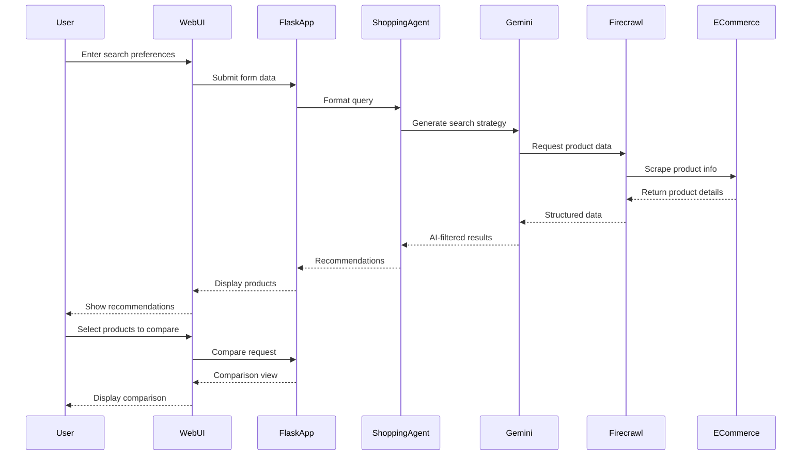
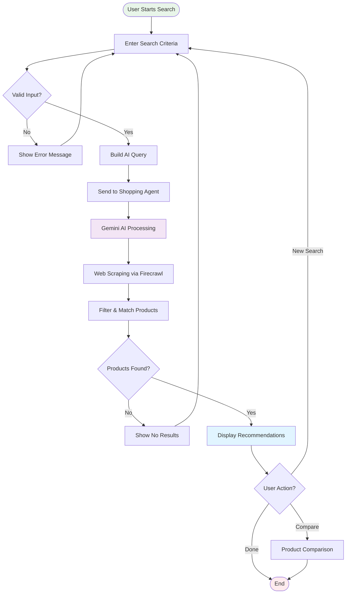
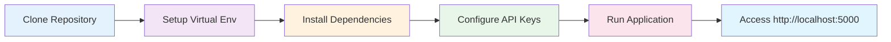
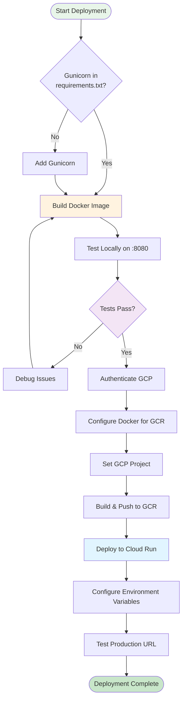
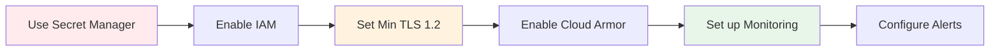
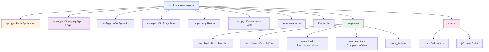
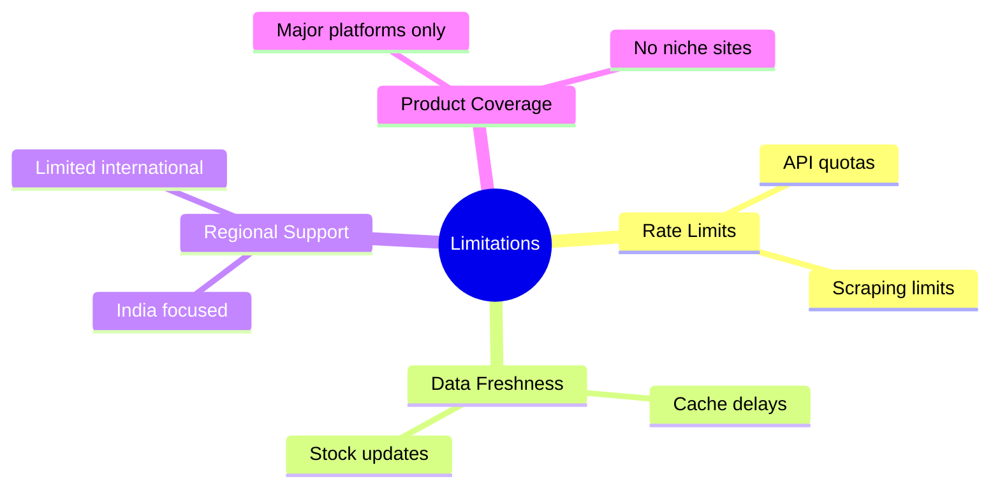
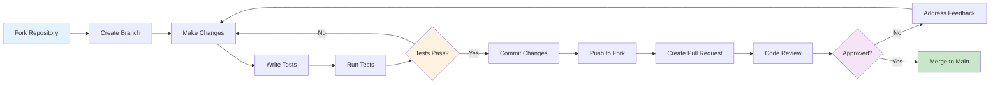

# 🛍️ AI-Powered Shopping Partner

> **Note**: This repository is named `stock-market-ai-agent` but contains a shopping recommendation system. The application provides intelligent product recommendations using AI.

An intelligent shopping recommendation agent powered by Google's Gemini AI and web scraping capabilities. Get personalized product recommendations from trusted e-commerce platforms based on your preferences, budget, and requirements.

## ✨ Key Features

| Feature | Description | Technology |
|---------|-------------|------------|
| 🤖 **AI-Powered Recommendations** | Smart product suggestions using Google's Gemini 2.0 Flash model | Google Gemini API |
| 🔍 **Web Scraping** | Real-time product data from trusted e-commerce sites | Firecrawl API |
| 💰 **Budget-Aware Search** | Filter products based on your budget range | Custom Algorithm |
| 🎯 **Preference Matching** | Match products with user preferences (quality, eco-friendly, etc.) | ML-based Filtering |
| 🏷️ **Multi-Platform Search** | Search across Amazon, Flipkart, Myntra, Meesho, and more | Multi-source Aggregation |
| ⚡ **Real-time Availability** | Verify product stock and availability | Live API Integration |
| 📊 **Product Comparison** | Compare multiple products side-by-side | Flask Web Interface |
| 🎨 **User-Friendly Interface** | Clean, responsive web interface | Bootstrap + Flask |

## 🏗️ System Architecture


```mermaid
graph TB
    subgraph "Frontend Layer"
        A[Web Browser] --> B[Flask Templates]
        B --> C[Bootstrap UI]
    end
    
    subgraph "Application Layer"
        D[Flask App] --> E[Shopping Agent]
        E --> F[Phi Agent Framework]
        F --> G[Gemini 2.0 Flash]
    end
    
    subgraph "Data Layer"
        H[Firecrawl API] --> I[Web Scraper]
        I --> J[Product Data]
    end
    
    subgraph "External Services"
        K[Google Shopping]
        L[Amazon]
        M[Flipkart]
        N[Other E-commerce Sites]
    end
    
    C --> D
    G --> H
    J --> F
    I --> K
    I --> L
    I --> M
    I --> N
    
    style A fill:#e1f5ff
    style D fill:#fff4e6
    style E fill:#f3e5f5
    style G fill:#e8f5e9
    style H fill:#fff3e0
```

## 🔄 User Interaction Flow


```mermaid
sequenceDiagram
    participant User
    participant WebUI
    participant FlaskApp
    participant ShoppingAgent
    participant Gemini
    participant Firecrawl
    participant ECommerce
    
    User->>WebUI: Enter search preferences
    WebUI->>FlaskApp: Submit form data
    FlaskApp->>ShoppingAgent: Format query
    ShoppingAgent->>Gemini: Generate search strategy
    Gemini->>Firecrawl: Request product data
    Firecrawl->>ECommerce: Scrape product info
    ECommerce-->>Firecrawl: Return product details
    Firecrawl-->>Gemini: Structured data
    Gemini-->>ShoppingAgent: AI-filtered results
    ShoppingAgent-->>FlaskApp: Recommendations
    FlaskApp-->>WebUI: Display products
    WebUI-->>User: Show recommendations
    
    User->>WebUI: Select products to compare
    WebUI->>FlaskApp: Compare request
    FlaskApp-->>WebUI: Comparison view
    WebUI-->>User: Display comparison
```

## 📊 Product Search Workflow


```mermaid
flowchart TD
    Start([User Starts Search]) --> Input[Enter Search Criteria]
    Input --> Validate{Valid Input?}
    Validate -->|No| Error[Show Error Message]
    Error --> Input
    Validate -->|Yes| BuildQuery[Build AI Query]
    BuildQuery --> SendToAgent[Send to Shopping Agent]
    SendToAgent --> AIProcess[Gemini AI Processing]
    AIProcess --> Scrape[Web Scraping via Firecrawl]
    Scrape --> Filter[Filter & Match Products]
    Filter --> Check{Products Found?}
    Check -->|No| NoResults[Show No Results]
    Check -->|Yes| Display[Display Recommendations]
    Display --> UserAction{User Action?}
    UserAction -->|Compare| Compare[Product Comparison]
    UserAction -->|New Search| Input
    UserAction -->|Done| End([End])
    NoResults --> Input
    Compare --> End
    
    style Start fill:#e8f5e9
    style End fill:#ffebee
    style AIProcess fill:#f3e5f5
    style Display fill:#e1f5ff
```

## 🧰 Prerequisites

| Requirement | Version | Purpose | Installation |
|-------------|---------|---------|--------------|
| [Python](https://www.python.org/downloads/) | 3.8+ | Core runtime environment | `brew install python3` (macOS) / `apt install python3` (Linux) |
| [Docker](https://docs.docker.com/get-docker/) | Latest | Containerized deployment | [Download Docker](https://www.docker.com/products/docker-desktop) |
| [Google API Key](https://ai.google.dev/) | N/A | Gemini AI access | Create at Google AI Studio |
| [Firecrawl API Key](https://www.firecrawl.dev/) | N/A | Web scraping service | Sign up at Firecrawl |
| Google Cloud | Account (Optional) | Cloud deployment | [GCP Console](https://console.cloud.google.com/) |

## 🛠️ Technology Stack

| Category | Technology | Version | Purpose |
|----------|-----------|---------|---------|
| **AI/ML** | Google Gemini | 2.0 Flash Exp | AI-powered recommendations |
| **Web Framework** | Flask | Latest | Web application server |
| **Agent Framework** | Phi Data | 2.7.10 | AI agent orchestration |
| **Web Scraping** | Firecrawl | 1.13.5 | Product data extraction |
| **Frontend** | Bootstrap | 5.x | Responsive UI design |
| **Forms** | Flask-WTF | Latest | Form handling & validation |
| **Production Server** | Gunicorn | 21.2.0 | WSGI HTTP server |
| **Container** | Docker | Latest | Application containerization |
| **Cloud Platform** | Google Cloud Run | N/A | Serverless deployment |

## 🚀 Getting Started

### 💻 Local Development Setup


```mermaid
graph LR
    A[Clone Repository] --> B[Setup Virtual Env]
    B --> C[Install Dependencies]
    C --> D[Configure API Keys]
    D --> E[Run Application]
    E --> F[Access http://localhost:5000]
    
    style A fill:#e3f2fd
    style B fill:#f3e5f5
    style C fill:#fff3e0
    style D fill:#e8f5e9
    style E fill:#fce4ec
    style F fill:#e1f5ff
```

#### Step-by-Step Instructions

**1. Clone the repository:**
```bash
git clone https://github.com/Yash-Kavaiya/stock-market-ai-agent.git
cd stock-market-ai-agent
```

**2. Create and activate a virtual environment:**
```bash
# Create virtual environment
python -m venv venv

# Activate on Linux/macOS
source venv/bin/activate

# Activate on Windows
venv\Scripts\activate
```

**3. Install dependencies:**
```bash
pip install -r requirements.txt
```

**4. Set up environment variables:**

Create a `.env` file in the root directory:
```bash
# Required API Keys
GOOGLE_API_KEY=your_google_gemini_api_key
FIRECRAWL_API_KEY=your_firecrawl_api_key

# Flask Configuration
SECRET_KEY=your_secret_key_here
FLASK_ENV=development
```

**5. Run the application:**
```bash
# Using Flask development server
flask run

# Or using Python directly
python app.py
```

**6. Access the application:**
Open your browser and navigate to: `http://localhost:5000`

### 🔑 Environment Variables Reference

| Variable | Required | Description | Example |
|----------|----------|-------------|---------|
| `GOOGLE_API_KEY` | ✅ Yes | Google Gemini API key for AI features | `AIzaSy...` |
| `FIRECRAWL_API_KEY` | ✅ Yes | Firecrawl API key for web scraping | `fc-...` |
| `SECRET_KEY` | ✅ Yes | Flask secret key for session management | Random string |
| `FLASK_ENV` | ❌ No | Environment mode (development/production) | `development` |

## ☁️ Deploying to Google Cloud Run

### 🔄 Deployment Workflow


```mermaid
graph TB
    Start([Start Deployment]) --> Check{Gunicorn in<br/>requirements.txt?}
    Check -->|No| AddGunicorn[Add Gunicorn]
    Check -->|Yes| BuildDocker[Build Docker Image]
    AddGunicorn --> BuildDocker
    BuildDocker --> TestLocal[Test Locally on :8080]
    TestLocal --> TestPass{Tests Pass?}
    TestPass -->|No| Debug[Debug Issues]
    Debug --> BuildDocker
    TestPass -->|Yes| AuthGCP[Authenticate GCP]
    AuthGCP --> ConfigDocker[Configure Docker for GCR]
    ConfigDocker --> SetProject[Set GCP Project]
    SetProject --> BuildPush[Build & Push to GCR]
    BuildPush --> Deploy[Deploy to Cloud Run]
    Deploy --> SetEnvVars[Configure Environment Variables]
    SetEnvVars --> TestProd[Test Production URL]
    TestProd --> Success([Deployment Complete])
    
    style Start fill:#e8f5e9
    style Success fill:#c8e6c9
    style BuildDocker fill:#fff3e0
    style Deploy fill:#e1f5ff
    style TestPass fill:#f3e5f5
```

### 📋 Deployment Steps

#### Step 1: Verify Requirements

Ensure `gunicorn` is in your `requirements.txt` file (already included):

```bash
# Verify gunicorn is present
grep gunicorn requirements.txt
```

#### Step 2: Build and Test Docker Container Locally

```bash
# Build the Docker image
docker build -t shopping-agent .

# Run the container locally with environment variables
docker run -p 8080:8080 \
  -e GOOGLE_API_KEY=your_google_api_key \
  -e FIRECRAWL_API_KEY=your_firecrawl_key \
  -e SECRET_KEY=your_secret_key \
  shopping-agent
```

🌐 Visit `http://localhost:8080` to test your application.

#### Step 3: Deploy to Google Cloud Run

```bash
# 1. Authenticate with Google Cloud
gcloud auth login

# 2. Set your Google Cloud project ID
gcloud config set project YOUR_PROJECT_ID

# 3. Enable required APIs
gcloud services enable run.googleapis.com
gcloud services enable containerregistry.googleapis.com

# 4. Configure Docker to use Google Container Registry
gcloud auth configure-docker

# 5. Build and tag the Docker image
docker build -t gcr.io/YOUR_PROJECT_ID/shopping-agent .

# 6. Push the image to Google Container Registry
docker push gcr.io/YOUR_PROJECT_ID/shopping-agent

# 7. Deploy to Cloud Run
gcloud run deploy shopping-agent \
  --image gcr.io/YOUR_PROJECT_ID/shopping-agent \
  --platform managed \
  --region us-central1 \
  --allow-unauthenticated \
  --memory 512Mi \
  --cpu 1 \
  --timeout 300 \
  --set-env-vars="GOOGLE_API_KEY=your_google_key,FIRECRAWL_API_KEY=your_firecrawl_key,SECRET_KEY=your_secret,FLASK_ENV=production"
```

### ⚙️ Cloud Run Configuration Options

| Parameter | Description | Recommended Value |
|-----------|-------------|-------------------|
| `--memory` | Memory allocation per container | `512Mi` - `1Gi` |
| `--cpu` | CPU allocation | `1` or `2` |
| `--timeout` | Request timeout in seconds | `300` (5 minutes) |
| `--concurrency` | Max concurrent requests per container | `80` |
| `--min-instances` | Minimum instances to keep warm | `0` (cost-effective) or `1` (faster response) |
| `--max-instances` | Maximum instances to scale to | `10` |
| `--allow-unauthenticated` | Public access | Use for public apps |

### 🔒 Security Best Practices


```mermaid
graph LR
    A[Use Secret Manager] --> B[Enable IAM]
    B --> C[Set Min TLS 1.2]
    C --> D[Enable Cloud Armor]
    D --> E[Set up Monitoring]
    E --> F[Configure Alerts]
    
    style A fill:#ffebee
    style C fill:#fff3e0
    style E fill:#e8f5e9
```

**For Production Deployments:**

1. **Use Google Secret Manager** instead of environment variables:
```bash
# Create secrets
echo -n "your_api_key" | gcloud secrets create GOOGLE_API_KEY --data-file=-

# Grant access to Cloud Run service account
gcloud secrets add-iam-policy-binding GOOGLE_API_KEY \
  --member="serviceAccount:YOUR_SERVICE_ACCOUNT" \
  --role="roles/secretmanager.secretAccessor"

# Deploy with secrets
gcloud run deploy shopping-agent \
  --set-secrets="GOOGLE_API_KEY=GOOGLE_API_KEY:latest"
```

2. **Enable VPC Connector** for private services
3. **Set up Cloud Monitoring** and alerts
4. **Configure custom domain** with SSL

## 📚 Application Routes & API

### Web Interface Routes

| Endpoint | Method | Description | Parameters | Response |
|----------|--------|-------------|------------|----------|
| `/` | GET | Home page with search form | None | HTML form interface |
| `/` | POST | Submit search preferences | Form data | Redirect to results |
| `/results` | GET | Display product recommendations | Session data | HTML with recommendations |
| `/compare` | POST | Compare selected products | `compare_products[]` | HTML comparison view |

### Form Parameters

| Field | Type | Required | Options | Description |
|-------|------|----------|---------|-------------|
| `category` | Select | ✅ Yes | Electronics, Clothing, Footwear, etc. | Product category |
| `specific_item` | String | ❌ No | Free text | Specific item name |
| `preferences` | Multi-select | ❌ No | Quality, Eco-friendly, Popular, etc. | User preferences |
| `budget` | Select | ✅ Yes | Various ranges | Budget range |
| `brand` | Select | ❌ No | Samsung, Apple, Nike, etc. | Preferred brand |
| `additional_info` | Text | ❌ No | Free text | Additional requirements |

### Response Formats

#### Successful Recommendation Response
```json
{
  "recommendations": "AI-generated product recommendations with details",
  "search_data": {
    "category": "footwear",
    "specific_item": "running shoes",
    "preferences": ["high_quality", "popular"],
    "budget": "5000-10000",
    "brand": "nike"
  },
  "query": "Formatted query sent to AI"
}
```

#### Error Response
```json
{
  "error": "Error message description",
  "status": "failed"
}
```

## 📁 Project Structure


```mermaid
graph TD
    Root[stock-market-ai-agent/] --> App[app.py - Flask Application]
    Root --> Agent[agent.py - Shopping Agent Logic]
    Root --> Config[config.py - Configuration]
    Root --> Main[main.py - CLI Entry Point]
    Root --> Run[run.py - App Runner]
    Root --> Data[data.py - Data Analysis Tools]
    Root --> Req[requirements.txt]
    Root --> Docker[Dockerfile]
    Root --> Templates[templates/]
    Root --> Static[static/]
    
    Templates --> Base[base.html - Base Template]
    Templates --> Index[index.html - Search Form]
    Templates --> Results[results.html - Recommendations]
    Templates --> Compare[compare.html - Comparison View]
    Templates --> StockList[stock_list.html]
    
    Static --> CSS[css/ - Stylesheets]
    Static --> JS[js/ - JavaScript]
    
    style Root fill:#e3f2fd
    style App fill:#fff3e0
    style Agent fill:#f3e5f5
    style Templates fill:#e8f5e9
    style Static fill:#fce4ec
```

### Detailed File Structure

```
stock-market-ai-agent/
│
├── 📄 app.py                    # Main Flask application & routes
├── 📄 agent.py                  # ShoppingAgent class implementation
├── 📄 config.py                 # Configuration classes & settings
├── 📄 main.py                   # CLI testing script
├── 📄 run.py                    # Application runner
├── 📄 data.py                   # Data analysis tools (DuckDB)
├── 📄 fin.py                    # Financial data utilities
│
├── 📁 templates/                # Jinja2 HTML templates
│   ├── base.html                # Base template with common layout
│   ├── index.html               # Home page with search form
│   ├── results.html             # Product recommendations display
│   ├── compare.html             # Product comparison page
│   └── stock_list.html          # Stock listing page
│
├── 📁 static/                   # Static assets
│   ├── css/                     # Stylesheets
│   └── js/                      # JavaScript files
│
├── 📄 requirements.txt          # Python dependencies
├── 📄 Dockerfile                # Docker container configuration
├── 📄 .dockerignore             # Docker ignore rules
├── 📄 .gitignore                # Git ignore rules
└── 📄 README.md                 # This documentation
```

### Core Components

| File | Purpose | Key Classes/Functions |
|------|---------|----------------------|
| `app.py` | Flask web application | `create_app()`, `SearchForm`, Routes |
| `agent.py` | AI agent implementation | `ShoppingAgent`, `get_recommendations()`, `format_query()` |
| `config.py` | Configuration management | `Config`, `DevelopmentConfig`, `ProductionConfig` |
| `main.py` | CLI entry point | Direct agent testing |
| `data.py` | Data analysis | `DuckDbAgent` for data queries |

## 🎯 Usage Examples

### Basic Product Search

```python
from agent import ShoppingAgent
import os

# Initialize the agent
agent = ShoppingAgent(
    google_api_key=os.getenv('GOOGLE_API_KEY'),
    firecrawl_api_key=os.getenv('FIRECRAWL_API_KEY')
)

# Format a query
query = agent.format_query(
    category='footwear',
    specific_item='running shoes',
    preferences=['high_quality', 'popular'],
    budget_range='5000-10000',
    brand='nike',
    additional_info='Need cushioning for long-distance running'
)

# Get recommendations
recommendations = agent.get_recommendations(query)
print(recommendations)
```

### Web Interface Usage

1. **Navigate to home page** → Fill in search criteria
2. **Submit form** → View AI-generated recommendations
3. **Select products** → Compare side-by-side
4. **Refine search** → Adjust preferences and search again

## 🐛 Troubleshooting

### Common Issues & Solutions

| Issue | Possible Cause | Solution |
|-------|---------------|----------|
| ❌ "API keys not found" | Missing `.env` file | Create `.env` with required API keys |
| ❌ "ModuleNotFoundError" | Dependencies not installed | Run `pip install -r requirements.txt` |
| ❌ "Port already in use" | Another app using port 5000 | Use `flask run --port 8000` or kill the other process |
| ❌ "Firecrawl API error" | Invalid/expired API key | Check and update `FIRECRAWL_API_KEY` in `.env` |
| ❌ "Gemini API error" | Invalid/quota exceeded | Verify `GOOGLE_API_KEY` and check quota |
| ❌ Docker container exits | Missing environment vars | Ensure all env vars are set in `docker run` command |
| ⚠️ Slow responses | Heavy web scraping | Normal behavior; scraping takes time |
| ⚠️ No products found | Too specific criteria | Broaden search parameters |

### Debug Mode

Enable detailed logging for troubleshooting:

```bash
# Set Flask to debug mode
export FLASK_ENV=development
export FLASK_DEBUG=1

# Run with verbose output
flask run --debug
```

### Checking API Status

```python
# Test Google Gemini API
import google.generativeai as genai
genai.configure(api_key="your_key")
model = genai.GenerativeModel('gemini-2.0-flash-exp')
response = model.generate_content("Hello")
print(response.text)

# Test Firecrawl API
from firecrawl import FirecrawlApp
app = FirecrawlApp(api_key="your_key")
result = app.scrape_url('https://example.com')
print(result)
```

## 📊 Performance & Limitations

### Performance Metrics

| Metric | Value | Notes |
|--------|-------|-------|
| Average Response Time | 5-15 seconds | Depends on web scraping |
| Max Concurrent Users | 80 (Cloud Run) | Configurable |
| Search Accuracy | ~85-90% | AI-based matching |
| Supported E-commerce Sites | 10+ major platforms | Expandable |

### Known Limitations


```mermaid
mindmap
  root((Limitations))
    Rate Limits
      API quotas
      Scraping limits
    Data Freshness
      Cache delays
      Stock updates
    Regional Support
      India focused
      Limited international
    Product Coverage
      Major platforms only
      No niche sites
```

## 🤝 Contributing

We welcome contributions! Here's how you can help:

### Contribution Types

| Type | Description | Difficulty |
|------|-------------|------------|
| 🐛 **Bug Fixes** | Fix existing issues | ⭐ Easy |
| ✨ **New Features** | Add functionality | ⭐⭐ Medium |
| 📚 **Documentation** | Improve docs | ⭐ Easy |
| 🎨 **UI/UX** | Enhance interface | ⭐⭐ Medium |
| 🧪 **Testing** | Add test coverage | ⭐⭐⭐ Hard |
| 🔒 **Security** | Security improvements | ⭐⭐⭐ Hard |

### Contribution Workflow


```mermaid
graph LR
    A[Fork Repository] --> B[Create Branch]
    B --> C[Make Changes]
    C --> D[Write Tests]
    D --> E[Run Tests]
    E --> F{Tests Pass?}
    F -->|No| C
    F -->|Yes| G[Commit Changes]
    G --> H[Push to Fork]
    H --> I[Create Pull Request]
    I --> J[Code Review]
    J --> K{Approved?}
    K -->|No| L[Address Feedback]
    L --> C
    K -->|Yes| M[Merge to Main]
    
    style A fill:#e3f2fd
    style M fill:#c8e6c9
    style F fill:#fff3e0
    style K fill:#f3e5f5
```

### Steps to Contribute

1. **Fork the repository**
2. **Create a feature branch**: `git checkout -b feature/amazing-feature`
3. **Make your changes**
4. **Run tests**: `pytest` (if available)
5. **Commit**: `git commit -m 'Add amazing feature'`
6. **Push**: `git push origin feature/amazing-feature`
7. **Open a Pull Request**

### Code Style Guidelines

- Follow **PEP 8** for Python code
- Use **meaningful variable names**
- Add **docstrings** to functions
- Keep functions **small and focused**
- Write **clear commit messages**

## 📝 License

This project is licensed under the **MIT License**.

```
MIT License

Copyright (c) 2024 Yash Kavaiya

Permission is hereby granted, free of charge, to any person obtaining a copy
of this software and associated documentation files (the "Software"), to deal
in the Software without restriction, including without limitation the rights
to use, copy, modify, merge, publish, distribute, sublicense, and/or sell
copies of the Software, and to permit persons to whom the Software is
furnished to do so, subject to the following conditions:

The above copyright notice and this permission notice shall be included in all
copies or substantial portions of the Software.
```

## 🙏 Acknowledgments

| Component | Credit | Link |
|-----------|--------|------|
| **Phi Data** | Agent framework | [phidata.com](https://www.phidata.com/) |
| **Google Gemini** | AI model | [ai.google.dev](https://ai.google.dev/) |
| **Firecrawl** | Web scraping service | [firecrawl.dev](https://www.firecrawl.dev/) |
| **Flask** | Web framework | [flask.palletsprojects.com](https://flask.palletsprojects.com/) |
| **Bootstrap** | UI framework | [getbootstrap.com](https://getbootstrap.com/) |

## 📞 Support & Contact

| Channel | Link | Purpose |
|---------|------|---------|
| 🐛 **Issues** | [GitHub Issues](https://github.com/Yash-Kavaiya/stock-market-ai-agent/issues) | Bug reports & feature requests |
| 💬 **Discussions** | [GitHub Discussions](https://github.com/Yash-Kavaiya/stock-market-ai-agent/discussions) | Questions & community chat |
| 🌟 **Star** | [GitHub Star](https://github.com/Yash-Kavaiya/stock-market-ai-agent) | Show your support! |

---

<div align="center">

**Made with ❤️ by [Yash Kavaiya](https://github.com/Yash-Kavaiya)**

If you find this project helpful, please consider giving it a ⭐!

[](https://github.com/Yash-Kavaiya/stock-market-ai-agent)
[](https://github.com/Yash-Kavaiya/stock-market-ai-agent/fork)
[](https://github.com/Yash-Kavaiya/stock-market-ai-agent)

</div>
